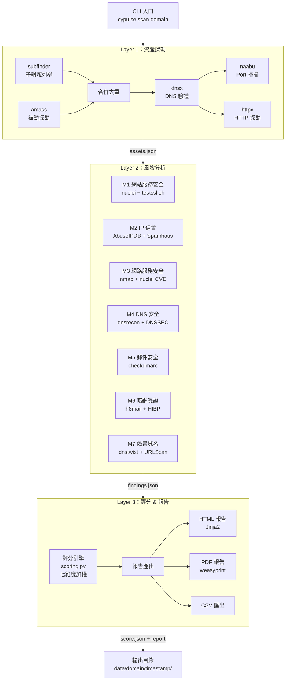
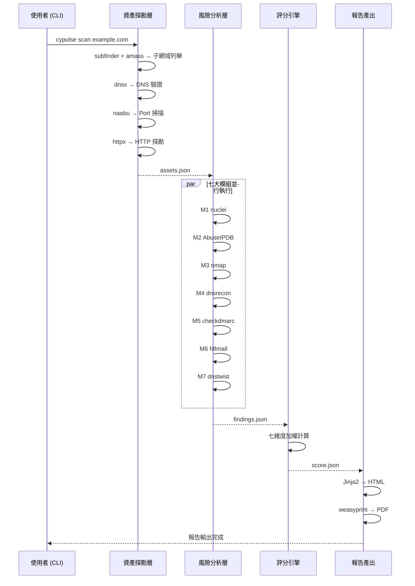

# Architecture — CyPulse 系統架構文件

| 欄位 | 內容 |
|------|------|
| **專案** | CyPulse |
| **版本** | v0.1.0 |
| **最後更新** | 2026-03-12 |

---

## 系統概覽

CyPulse 是一個三層式 CLI 資安曝險評級平台，透過 Outside-In 非侵入式掃描，對目標域名進行七大面向的資安分析，產出量化評分（0-100）與繁體中文報告。整體架構分為：資產探勘層、風險分析層、評分報告層，各層之間以 JSON 格式傳遞資料。

---

## 架構圖

---

## 模組清單

| 模組 | 職責 | 技術棧 |
|------|------|--------|
| `cli` | CLI 入口、參數解析、流程編排 | Python argparse |
| `discovery/subfinder` | 子網域被動列舉 | subfinder CLI (Go binary) |
| `discovery/amass` | 子網域被動探勘 | amass CLI (Go binary) |
| `discovery/dnsx` | DNS 解析驗證 | dnsx CLI (Go binary) |
| `discovery/httpx` | HTTP 服務探勘 | httpx CLI (Go binary) |
| `discovery/naabu` | Port 掃描 | naabu CLI (Go binary) |
| `analysis/web_security` | M1：網站服務安全 | nuclei + testssl.sh |
| `analysis/ip_reputation` | M2：IP 信譽 | AbuseIPDB API + Spamhaus |
| `analysis/network` | M3：網路服務安全 | nmap + nuclei CVE templates |
| `analysis/dns_security` | M4：DNS 安全 | dnsrecon + dnsx |
| `analysis/email_security` | M5：郵件安全 | checkdmarc |
| `analysis/darkweb` | M6：暗網憑證 | h8mail + HIBP API |
| `analysis/fake_domain` | M7：偽冒域名 | dnstwist + URLScan.io |
| `scoring/engine` | 七維度加權評分 | Python |
| `report/generator` | HTML/PDF/CSV 報告產出 | Jinja2 + weasyprint |
| `automation/scheduler` | Cron 排程管理 | Python + cron |
| `automation/notifier` | Slack/Email/LINE 通知 | Python requests + smtplib |
| `automation/diff` | 掃描差異比對 | Python |

---

## 資料流

---

## 外部依賴

| 依賴 | 用途 | 版本 | 替代方案 |
|------|------|------|----------|
| subfinder | 子網域被動列舉 | latest | amass |
| amass | 子網域補充探勘 | v4+ | subfinder |
| dnsx | DNS 批量解析 | latest | dig（效能差） |
| httpx | HTTP 服務偵測 | latest | curl（功能不足） |
| naabu | 快速 Port 掃描 | latest | nmap（速度慢） |
| nuclei | 模板式漏洞掃描 | v3+ | — |
| nmap | 服務版本偵測 + vuln scripts | 7+ | nuclei CVE templates |
| checkdmarc | SPF/DKIM/DMARC 檢測 | latest（PyPI） | 手動 DNS 查詢 |
| dnstwist | 偽冒域名偵測 | latest（PyPI） | — |
| h8mail | 憑證外洩搜尋 | latest（PyPI） | HIBP 網頁版 |
| Jinja2 | HTML 模板引擎 | 3+ | — |
| weasyprint | HTML → PDF | latest | wkhtmltopdf |
| Noto Sans TC | 繁中字型 | latest | — |

---

## 安全邊界

CyPulse 為本地 CLI 工具，不提供網路服務，安全邊界如下：

- **掃描授權**：使用者有責任確認目標 domain 已獲授權掃描
- **API Key 保護**：h8mail / AbuseIPDB 等 API Key 存放於 `.env` 檔案（加入 .gitignore）
- **subprocess 安全**：所有外部工具呼叫需對輸入做 domain 格式驗證，防止命令注入
- **輸出隱私**：掃描結果可能包含敏感資訊（外洩帳號等），儲存目錄應限制存取權限
- **日誌安全**：日誌中不記錄 API Key 與密碼

---

## 已知技術債

- [ ] JSON 檔案儲存在大量歷史掃描時可能遇到 I/O 瓶頸，未來可考慮 SQLite
- [ ] PD 工具 binary 版本需手動更新，無自動升級機制
- [ ] 七大模組目前為序列執行，未來應改為並行（asyncio + subprocess）

---

## 關聯 ADR

- ADR-001：初始技術棧選型（Python + ProjectDiscovery + Docker）
